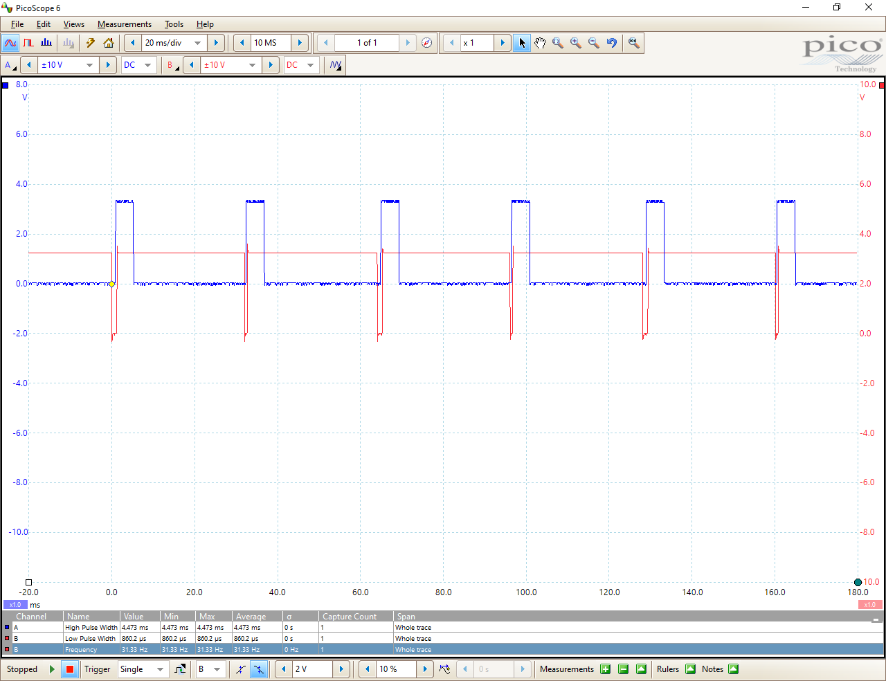

## Introduction

The info in this folder shows  the timing relationships between IMU data ready interrupt signals and data processing by the IMU. GPIO lines have been used to provide timing information for an oscilloscope display. Most any relatively inexpensive USB scope could be used for this purpose.

Please refer to the timing_trace_trace-polling.png image file.

## Data Ready INT vs. Processing

The blue trace (active high) shows the amount of time that the program is processing new IMU data. The red trace (active low) shows how long the interrupt is active for.

When new IMU data is ready, the red signal goes low. On the next poll check_imu_data() sees that the data ready interrupt signal is low. It sets the blue MCU_ACTIVE gpio line high, reads and sends the data for plotting, then drops the MCU_ACTIVE line. Not that the red data ready signal returns high (inactive) almost immediately one the IMU's data registers have been read.

The measurement table at the bottom of the window shows that:
  * processing takes about 4.47ms after detecting new data
  * the INT line only stays active for about 0.86ms
  * the sampling frequency is 31.33Hz or about once every 31.9ms.

It's worth noting that the second item is dependent on latency of the program to return to the check_imu_data() function. In this case, there's a 1ms delay in the main loop.

For this example, the sampling rate could be increased to around 200Hz.

