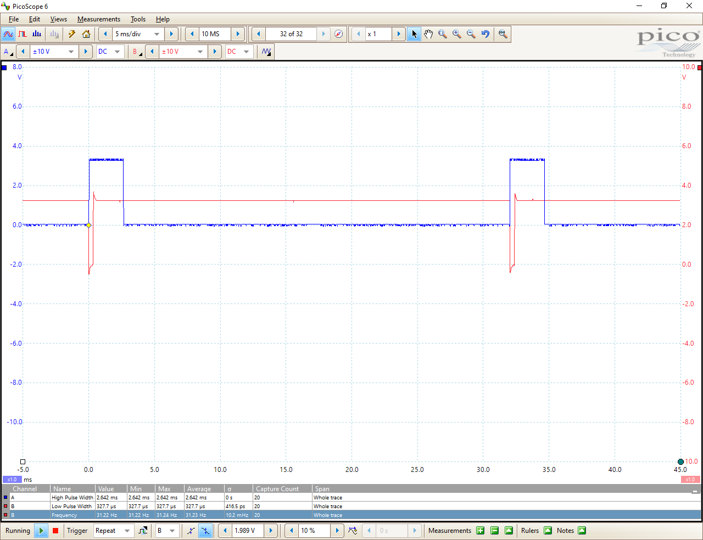
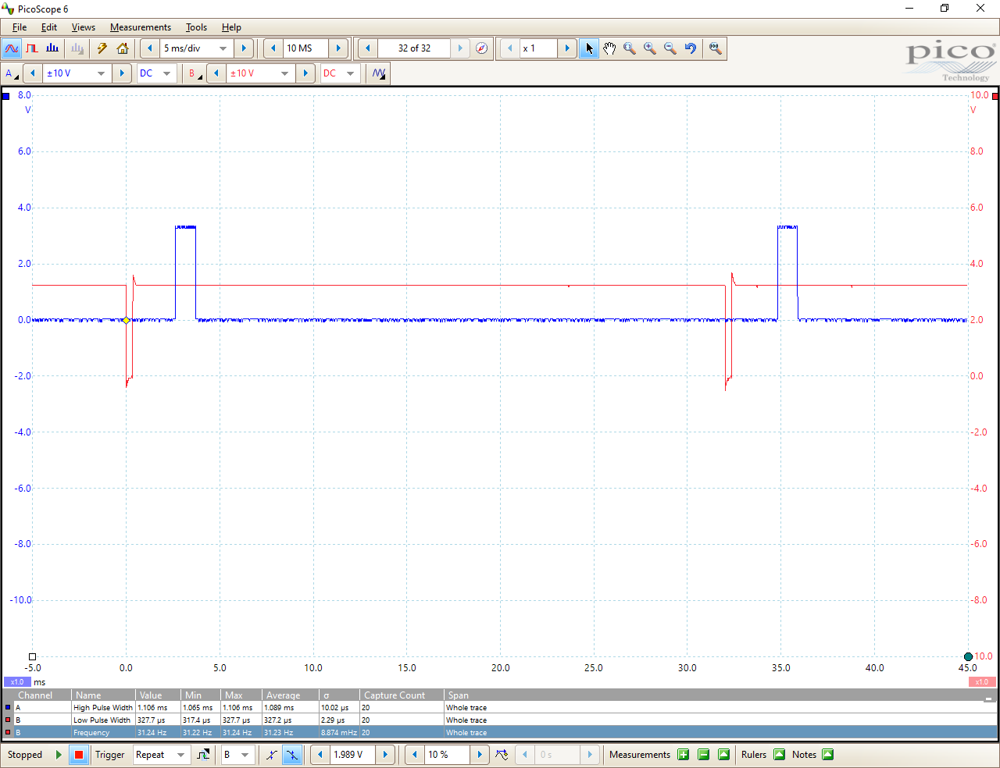
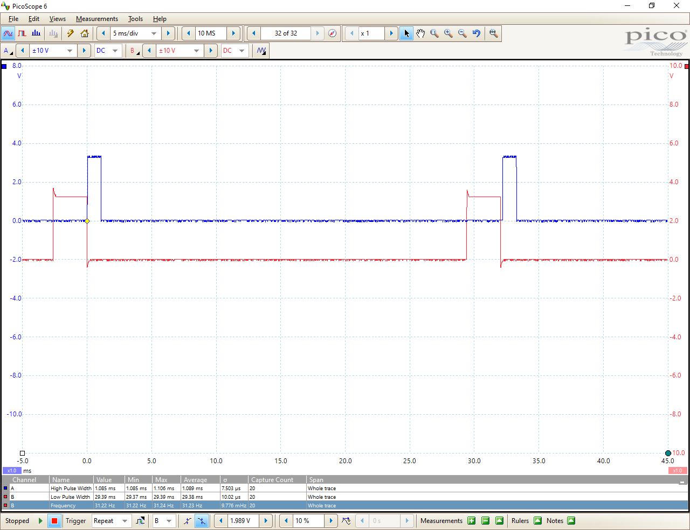
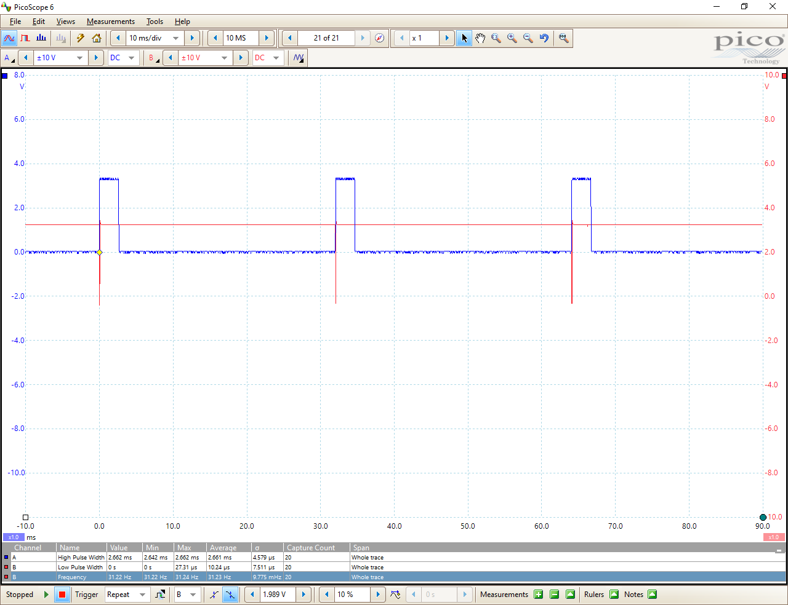

## Introduction	

The info in this folder shows the timing relationships between interrupt requests (IRQ), interrupt service routines (ISR) and processing (PROC) tasks. The example sketch shows how GPIO lines can be used to provide timing signals for an oscilloscope display. Most any relatively inexpensive USB scope could be used for this purpose.

Note: I use interrupt handler and interrupt service routine interchangeably.

Please refer to the timing*.png image files.

## IRQ vs. ISR

This image show the interrupt signal (IRQ) in relation to the ISR/handler. The ISR is
active immediately when the falling interrupt signal triggers the ISR. The IMU  raises the data ready signal (inactive high)  once the data registers have been read. If you want an active high IRQ, leave the interrupt as active high in the MCU configuration, and change the direction to RISING in the attachInterrupt() call.

## IRQ vs. Processing

The top blue trace (active high) shows how long it takes for the main program to process new IMU data. The red trace (active low) shows the interrupt which is cleared by the interrupt handler's read (shown next) of the IMU's data registers. The time needed to fetch and store the IMU data is no longer attributed to the processing task as compared to the polling example.

## ISR vs. Processing

This image shows the ISR in red and background processing in blue. There is no meaningful background processing so the data is processed immediately after the ISR has staged it. This is not always the case as it would normally take some time for the processing code to check the new data flag variable set by the ISR.

## IRQ Pulse vs. ISR

Here we commented out two lines of the interrupt configuration code to disable latching and clearing on any data read. By clearing latching, the interrupt is just a 50us pulse that doesn't require clearing by the MCU. Now the interrupt request (IRQ) is just a pulse that clears as the handler starts to run. This is the simplest in terms of clearing the interrupt as long as your hardware and cabling supports the short pulse.

